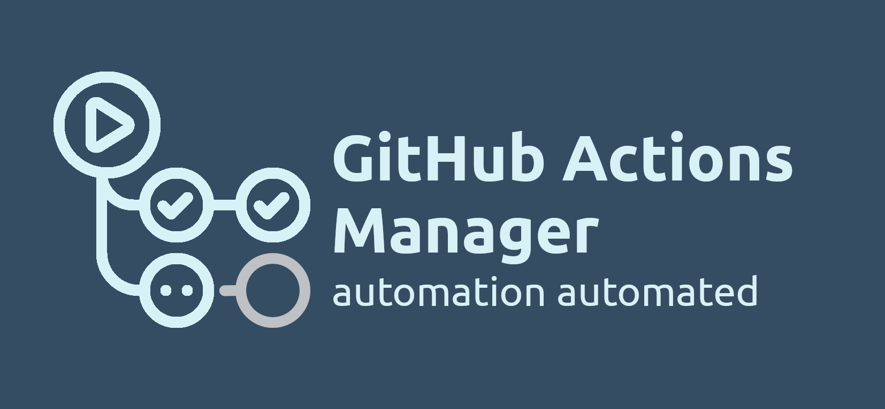

# GitHub Actions Manager

[](https://www.npmjs.com/package/github-actions)


> -- Who will test our unit tests?
>
> -- I have no idea 🤨
>
> -- Okay, who will automate our automation?
>
> -- GitHub Actions Manager 😎

Kickstart automation in one command.
Clone, update and share [GitHub Actions](https://github.com/features/actions) workflows and best practices.

Comes with awesome packs for
[Node.js](./workflows/README.md),
[Python](./workflows_py/README.md),
[Go](https://github.com/mvdan/github-actions-golang),
[Terraform](https://github.com/dflook/terraform-github-actions),
[Julia](https://github.com/julia-actions/Example.jl),
and [Rust](https://github.com/actions-rs/example) projects.

- [GitHub Actions Manager](#github-actions-manager)
  - [Basic usage](#basic-usage)
  - [Automated automation?](#automated-automation)
  - [Let's start today](#lets-start-today)
  - [Advanced usage](#advanced-usage)
    - [Simple, no-force update](#simple-no-force-update)
    - [Force update](#force-update)
    - [CLI arguments](#cli-arguments)
  - [Version 1.0.0 checklist](#version-100-checklist)
  - [Versioning](#versioning)
  - [Latest changes](#latest-changes)



## Basic usage

```bash
# install globally or locally
npm i -g github-actions
# npm i --save-dev github-actions

# run interactive manager
# in a GitHub repository root
ghactions

# or check how to run non-interactively
ghactions --help
```

## Automated automation?

Yes, why not! Even small projects nowadays have at least simple CI/CD to enforce best practices
or just to avoid boring release management. Thanks to [GitHub Actions](https://github.com/features/actions),
it is super easy to kickstart an automation for a new project in minutes.

However, every project CI/CD has to be set up and updated separately,
even though they have a lot in common. So, instead of making our life easier,
CI/CD adds a new folder in a project to keep an eye on.

But imagine, what if we could...

- manage our GitHub Actions the same way we manage npm dependencies
- adapt CI/CD for different projects to our needs and still keep them in sync
- share the best CI/CD practices and collaborate to raise the bar even higher

And finally, what if we could add these best practices for a new project with a single command.

## Let's start today
- CI/CD for `Node.js` projects [installation guide](./nodejs_workflows/README.md)
- CI/CD for `Python` projects [installation guide](./python_workflows_py/README.md)
- CI/CD for `Rust` projects by [@actions-rs](https://github.com/actions-rs/example)
- CI/CD for `Go` projects by [@mvdan](https://github.com/mvdan/github-actions-golang)
- CI/CD for `Julia` projects by [@julia-actions](https://github.com/julia-actions/Example.jl)
- CI/CD for `Terraform` projects by [@dflook](https://github.com/dflook/terraform-github-actions)
- Or provide path to any GitHub repository to clone their workflows (run `ghactions`, then select `From GitHub URL`)
- Or even clone workflows from your local path (run `ghactions`, then select `From directory`)

## Advanced usage

### Simple, no-force update

- `jobs.*` are added fom remote
- `jobs.*.steps` that are `github-actions-managed` are updated from remote or removed if they do not exist remotely
- `jobs.*.steps` that are not `github-actions-managed` are kept untouched and preserve their position in workflow
- `jobs.*.steps` that exist only remotely are added to workflow to correct position, so to remove step, make in not managed and run empty `run` command to it, keep `id` the same.

### Force update

- Top comment in YAML file is replaced with remote
- `jobs.*` are deleted if they do not exist remotely
- `name` workflow name is replaced with remote
- `on` triggers are replaced with remote
- `jobs.*.env` is replaced with remote
- `jobs.*.strategy` is replaced with remote
- `jobs.*.runs-on` is replaced with remote
- `jobs.*.if` is replaced with remote

### CLI arguments

| Short | Long | Default | Description |
| - | - | - | - |
| `-n <name>[ <name>]*` | `--names <name>[ <name>]*` | interactive mode | Workflow name `<name>.yml`, `all`, or `installed` |
| `-i <url>` | `--index <url>` | `<GitHub URL>` / `file:///url` / `node` / `python` | Link to workflows directory `.../.github/workflows` |
| `-r <version>` | `--ref <version>` | | Update workflows to a specific tag/branch |
| `-p <path>` | `--path <path>` | current workdir | Path to GitHub project root |
| `-u` | `--update` | | Apply suggested changes |
| `-f` | `--force` | | Update user-managed workflow parts |
| `-l` | `--list` | | List available workflows |
| `-d` | `--diff` | | Show diff for update and check runs |
| `-c` | `--clean` | | Do not add `github-actions-managed` marker to workflow steps |
| `-h` | `--help` | | Print this usage guide |
| `-v` | `--version` | | Show package version |

## Version 1.0.0 checklist
- [x] Unify `check` and `update` reports
- [x] Support user top comment in workflows
- [x] Add custom indexes support
- [x] Add `--list` argument to list workflows in index
- [x] Add `--path` argument to allow running not for a repository root
- [x] Smart diff
- [x] Interactive CLI
- [x] Generator for index READMEs
- [x] Add `--clean` CLI flag to remove `github-actions-managed` flags
- [ ] Interactive updates selection

## Versioning

`github-actions` adheres to [Semantic Versioning](https://semver.org/spec/v2.0.0.html).

## Latest changes

Full changelog can be found in [Changelog](./CHANGELOG.md).
Release notes can be found in [Releases](https://github.com/altitudenetworks/github_actions_js/releases).
